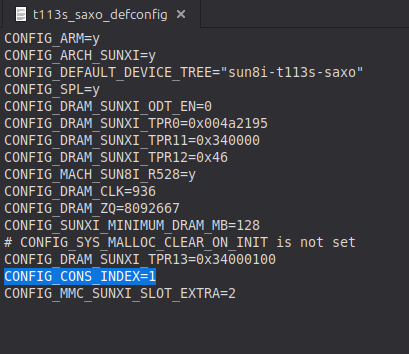
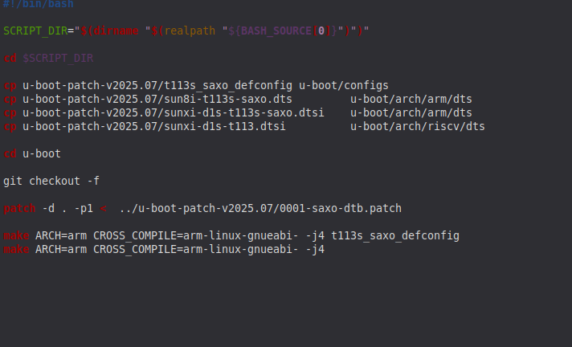
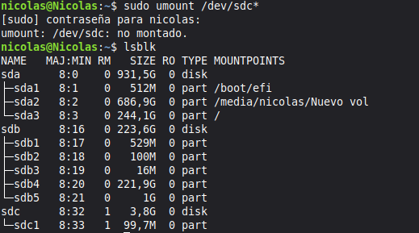
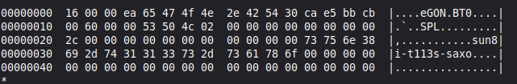
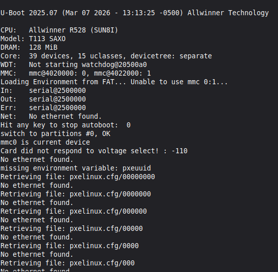

## Ejecución de U-Boot

Antes de compilar, es necesario configurar el archivo `t113s_saxo_defconfig`, ubicado en la carpeta `u-boot-patch-v2025.07`. Dentro de ese archivo se encuentra la línea `CONFIG_CONS_INDEX`, que define qué puerto UART se usará como consola. Por defecto viene en `4`, pero hay que ajustarla según el puerto que se esté utilizando. En este caso, siguiendo la configuración de la placa definida por el profesor Camargo, se usa el **UART0**, que corresponde al índice `1`:
```
CONFIG_CONS_INDEX=1
```


Otro archivo que se debe mirar dentro de la carpeta de parches, es el sunxi-d1s-t113s-saxo.dtsi, ahí aparece la siguiente línea:
```
stdout-path = "serial3:115200n8";
```
Es importante cambiar el serial3, por serial 0. Adicionalmente, en ese mismo documento, al final encontramos:
```
&uart3 {        
        pinctrl-names = "default";
        pinctrl-0 = <&uart3_pb_pins>;
        status = "okay";
};
```
el status por defecto es "okay", nosotros deberemos de colocar "disabled", y después de ese bloque, debemos de poner:
```
&uart0 {
        pinctrl-names = "default";
        pinctrl-0 = <&uart0_pe2_pins>;
        status = "okay";
};
```

Ahora, volviendo a la raíz del proyecto, se debe entrar al archivo build_u-boot.sh y como se puede ver en la imagen, el repositorio por defecto accede a una dirección de riscv, eso es incorrecto, se debe de reemplazar esa por arm, y eliminar la línea de 



```
git checkout -f
```
### Preparación de la microSD

Con eso listo, el siguiente paso es particionar la microSD. Accedo al menú de `fdisk` con:
```bash
sudo fdisk /dev/sdc
```

Dentro del menú interactivo, creo una nueva partición primaria con los siguientes pasos:

1. Presiono `n` para crear una nueva partición
2. Selecciono `p` (primaria) y le asigno el número `1`
3. Como primer sector ingreso `35360`, y como tamaño final `+100M`
4. Presiono `t` para cambiar el tipo de partición, y escribo `b` para asignarle **FAT32**
5. Finalmente presiono `w` para guardar los cambios

Para verificar que todo quedó bien, desmonto la SD, la retiro y la vuelvo a insertar:
```bash
sudo umount /dev/sdc*
```

Luego con `lsblk` confirmo que la partición fue creada correctamente.



Prosiguiendo, escribo este comando con el fin de formatear la partición:
```bash
sudo umount /dev/sdc*
```
sudo mkfs.fat /dev/sdc1


### Grabado del bootloader

Una vez lista la partición, grabo el bootloader directamente en la SD con:
```bash
sudo dd if=u-boot-sunxi-with-spl.bin of=/dev/sdc bs=1k seek=16400
```
Este comando se coloca en la dirección de u-boot

Este comando escribe el U-Boot (junto con el SPL) a partir del offset 16400 KB, que es la posición donde el ROM interno del T113 lo busca al encender el dispositivo. Es importante notar que esto se escribe **directamente sobre `/dev/sdc`**, no sobre la partición que creamos, esa la usaremos más adelante.



Desmonto nuevamente la sd, y para finalizar esta primera parte, se debe de colocar la micro en el SIP diseñado por el profesor, se conecta también el convertidor Serial-USB, y se lleva al pc, así como la alimentación de la placa. Desde ahí corro el siguiente comando:

```bash
sudo minicom -D /dev/ttyUSB0 -b 115200
```
Y veremos algo de la siguiente forma (después de aplicar el reset):

