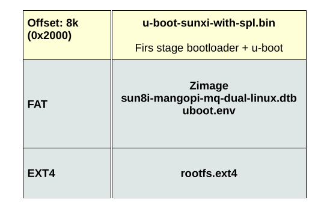

<p align="center">
  
</p>

1) Se activa la Boot ROM al encender el chip. Esta tiene como función encontrar el SPL en la SD/EMMC.
2) La SPL inicializa la RAM. Una vez lista la RAM, se carga el U-Boot. Cuando nos sale en el minicom algo como:
```
U-Boot SPL 2025.07 ...
DRAM: 128 MiB
Trying to boot from MMC1
```
Eso es que el SPL iniciliazó la DRAM de 128Mib y luego cargó el U-Boot completo.

Eso fue gracias al comando
```
sudo dd if=u-boot-sunxi-with-spl.bin of=/dev/sdc bs=1k seek=16400
```
Que tiene SPL y U-Boot empaquetados.

3) La partición FAT que hicimos, es para almacenar la imagen del kernel, el archivo dtb y el entorno de U-Boot. El entorno de U-Boot no es más que el sitio ese donde cambiamos las variables de entorno, eso se guarda en un archivo llamado "uboot.env". Así la próxima vez que arranquemos la placa, eso recuerda toda la configuración sin que tengamos que volver a escribirla.

4) Necesitamos ahora otra partición de tipo EXT4 que es aquí donde se aloja el sistema de archivos (rootfs). Es todo lo que está en / en Linux: los programas (/bin, /sbin), librerías (/lib), configuraciones (/etc), dispositivos (/dev), etc. Es básicamente el "sistema operativo" que el kernel carga después de arrancar.

La razón de tener dos particiones se debe a que U-Boot solo sabe leer FAT, entonces FAT le encarga los archivos anteriormente mencionados, y el kernel que sí puede leer EXT4 (que por defecto FAT no puede soportar el rootfs), es el que monta el sistema de archivos justamente.
