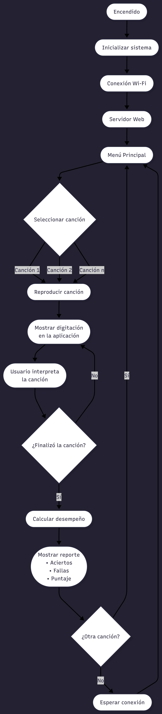

# SaxoTiles
## Integrantes:
1) Daniel Sepúlveda Suárez.
2) Nicolás Daniel Hinestroza García.
3) Samuel Mahecha Arango.

El presente repositorio documenta la información referente al proyecto desarrollado para la asignatura de Sistemas Embebidos 2026-1 de la Universidad Nacional de Colombia.

## Descripción
El proyecto consiste en la implementación de un Saxofón utilizando el SIP Allwinner T-113. Este proyecto está basado en el Haxophone realizado por Javier Cardona; sin embargo se realizarán algunas modificaciones, tales como:

### Características Generales
1) Se implementará una salida de audio mediante un parlante. 
2) El dispositivo tendrá conectividad Wi-Fi, con el fin de poder correr una pequeña aplicación web desde una computadora.
3) Se podrán elegir entre varias canciones con el fin de mejorar la habilidad del instrumento.
4) En la aplicación, la pantalla estará dividida en dos partes: La sección izquierda contará con el menú para elegir la melodía a interpretar, y la derecha tendrá un apoyo visual del saxofón para indicarle al usuario físicamente cuál nota debe tocar (con su respectiva digitación).
5) Al final de la canción se le presentará al usuario un reporte de su puntaje, en el que se indican los porcentajes de fallas y aciertos.

## Diagrama de flujo

  

